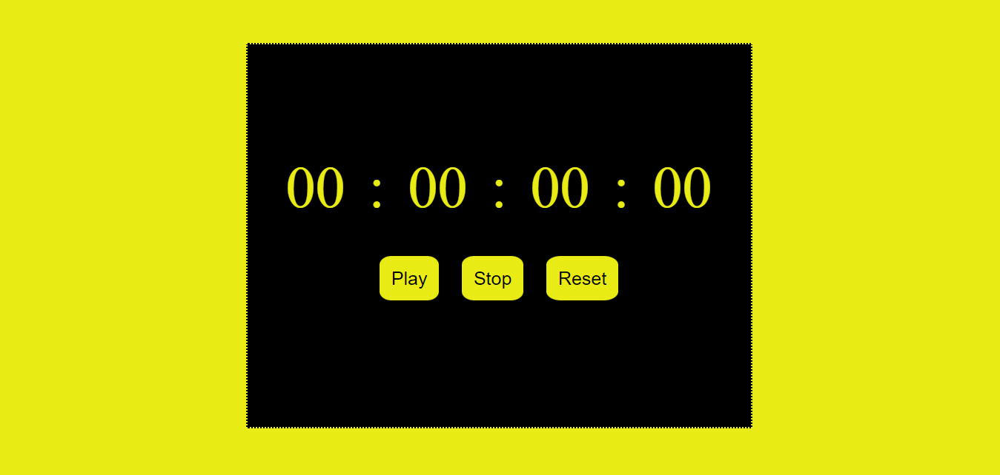

This work is licensed under a [Creative Commons Attribution 4.0 International License](http://creativecommons.org/licenses/by/4.0/)

# Stopwatch Web Application

This is a simple web-based stopwatch application that allows you to track time with precision. You can start, stop, and reset the stopwatch to monitor elapsed time accurately. This project consists of HTML, CSS, and JavaScript files.

## Table of Contents

- [Getting Started](#getting-started)
- [Usage](#usage)
- [Features](#features)
- [Contributing](#contributing)
- [License](#license)

## Getting Started

Follow these instructions to get a copy of the project up and running on your local machine.

### Prerequisites

- Web browser (e.g., Chrome, Firefox, or Edge)

### Installation

1. Clone the repository to your local machine:

   -bash
   git clone https://github.com/your-username/stopwatch-web-app.git
   Navigate to the project directory:
   -bash
   cd stopwatch-web-app
   
### Usage
Open the index.html file in your web browser to launch the stopwatch application.

You will see the stopwatch interface with buttons to control its functionality.

1. Click the "Play" button to start or resume the stopwatch.
2. Click the "Stop" button to pause the stopwatch.
3. Click the "Reset" button to reset the stopwatch to zero.
The stopwatch displays hours, minutes, seconds, and milliseconds. The values are updated in real-time.

### Features
1. Start, stop, and reset functionality for precise time tracking.
2. Display of hours, minutes, seconds, and milliseconds.
3. Responsive design for various screen sizes.
   
## Contributing
If you'd like to contribute to this project, please follow these guidelines:

Fork the repository on GitHub.

Create a new branch with a descriptive name:
-bash
git checkout -b feature/add-new-feature
Make your changes and commit them with clear, concise messages:

-bash
git commit -m "Add new feature: XYZ"
Push your branch to your fork:

-bash
git push origin feature/add-new-feature
Create a pull request on the original repository, explaining your changes and their purpose.

After review and approval, your changes will be merged into the main branch.

## License
This work is licensed under the Creative Commons Attribution 4.0 International License. To view a copy of this license, visit http://creativecommons.org/licenses/by/4.0/ or send a letter to Creative Commons, PO Box 1866, Mountain View, CA 94042, USA.

